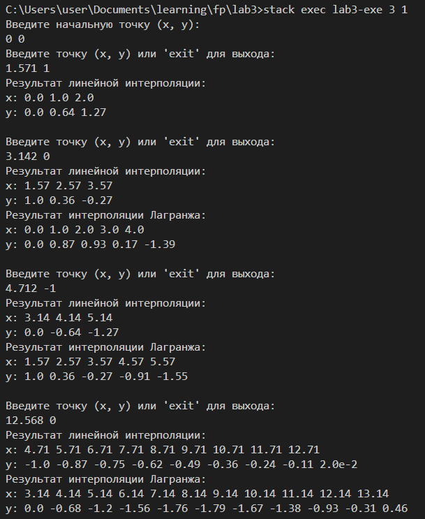

# Лабораторная работа №3

Хасаншин Марат Айратович P3333  

## Требования к разработанному ПО

1. Методы:
    - Линейная интерполяция
    - Лагранжа
2. Настройки алгоритма должны подаваться через аргументы командной строки.
3. Входные данные подаются на стандартный ввод.
4. Выходные данные подаются на стандартный вывод.
5. Программа должна работать в потоковм режиме
   (по мере получения данных должна выводить результат).

## Реализация программы

Методы интерполяции реализованы в [Interpolation.hs](src/Interpolation.hs)  

### Линейная интерполяция

```Haskell
linearInterpolation :: (Double, Double) -> (Double, Double) -> Double -> [(Double, Double)]
linearInterpolation (x1, y1) (x2, y2) step
  | step <= 0 = error "Step must be greater than 0"
  | otherwise = [(x, fromIntegral (round (interpolate x * 100) :: Integer) / 100) | x <- generatePoints x1 x2 step]
  where
    interpolate x = y1 + (x - x1) * (y2 - y1) / (x2 - x1)
```

### Метод Лагранжа

```Haskell
lagrangeInterpolation :: (Double, Double) -> (Double, Double) -> (Double, Double) -> Double -> [(Double, Double)]
lagrangeInterpolation (x0, y0) (x1, y1) (x2, y2) step
  | step <= 0 = error "Step must be greater than 0"
  | otherwise = [(x, fromIntegral (round (interpolate x * 100) :: Integer) / 100) | x <- generatePoints x0 x2 step]
  where
    interpolate x =
      y0 * ((x - x1) * (x - x2)) / ((x0 - x1) * (x0 - x2))
        + y1 * ((x - x0) * (x - x2)) / ((x1 - x0) * (x1 - x2))
        + y2 * ((x - x0) * (x - x1)) / ((x2 - x0) * (x2 - x1))
```

### Генерация точек

Реализована в [PointsGenerator.hs](src/PointsGenerator.hs)

```Haskell
generatePoints :: Double -> Double -> Double -> [Double]
generatePoints start end step = takeWhile (\x -> x <= end + step) $ map (\x -> fromIntegral (round (x * 100) :: Integer) / 100) [start, start + step ..]
```

### Процесс интерполяции

[ProcessInt.hs](src/ProcessInt.hs)

```Haskell
processInterpolation :: Int -> [(Double, Double)] -> Double -> IO ()
processInterpolation method points step = do
  let startPoint = points !! (length points - 2)
  let endPoint = last points

  let processLinear = do
        let output = linearInterpolation startPoint endPoint step
        putStrLn "Результат линейной интерполяции:"
        printOutput output

  let processLagrange = do
        let [p1, p2, p3] = drop (length points - 3) points
        let output = lagrangeInterpolation p1 p2 p3 step
        putStrLn "Результат интерполяции Лагранжа:"
        printOutput output

  case method of
    1 -> processLinear
    2 -> if length points >= 3 then processLagrange else putStrLn "Необходимо минимум 3 точки."
    3 -> do
      processLinear
      when (length points >= 3) processLagrange
  putStrLn ""
```

### Печать

```Haskell
printOutput :: [(Double, Double)] -> IO ()
printOutput output = do
  let xValues = map fst output
  let yValues = map snd output
  putStrLn $ "x: " ++ unwords (map show xValues)
  putStrLn $ "y: " ++ unwords (map show yValues)
```

### Main

```Haskell
main :: IO ()
main = do
  args <- getArgs
  case args of
    [methodArg, stepArg] -> do
      let method = readInput methodArg
      let step = readInputStep stepArg
      case (method, step) of
        (Just m, Just s) -> do
          putStrLn "Введите начальную точку (x, y):"
          startPointInput <- getLine
          let startPoint = readInputPoint startPointInput
          case startPoint of
            Just sp -> loop m [sp] s
            Nothing -> putStrLn "Некорректная начальная точка."
        _ -> putStrLn "Некорректные аргументы. Используйте: <метод> <шаг>"
    _ -> putStrLn "Неверное количество аргументов. Используйте: <метод> <шаг>"
```

```Haskell
loop :: Int -> [(Double, Double)] -> Double -> IO ()
loop method points step = do
  putStrLn "Введите точку (x, y) или 'exit' для выхода:"
  input <- getLine
  if input == "exit"
    then return ()
    else do
      let newPoint = readInputPoint input
      case newPoint of
        Just np -> do
          let newPoints = points ++ [np]
          processInterpolation method newPoints step
          loop method newPoints step
        Nothing -> putStrLn "Некорректный формат точки." >> loop method points step
```

## Работа программы


